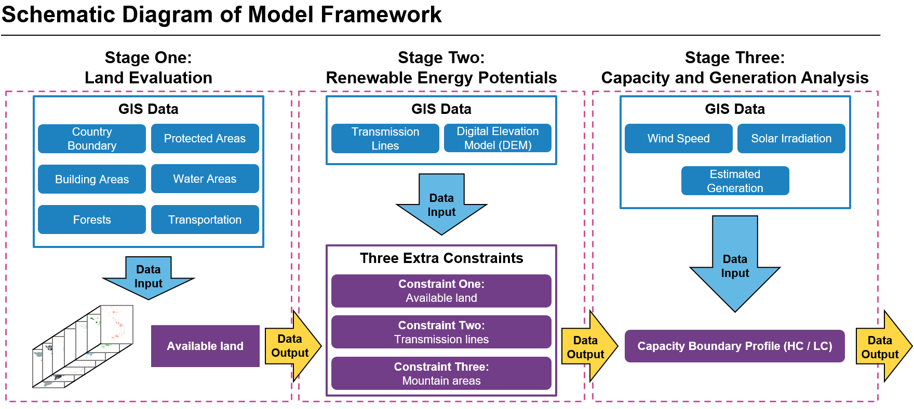
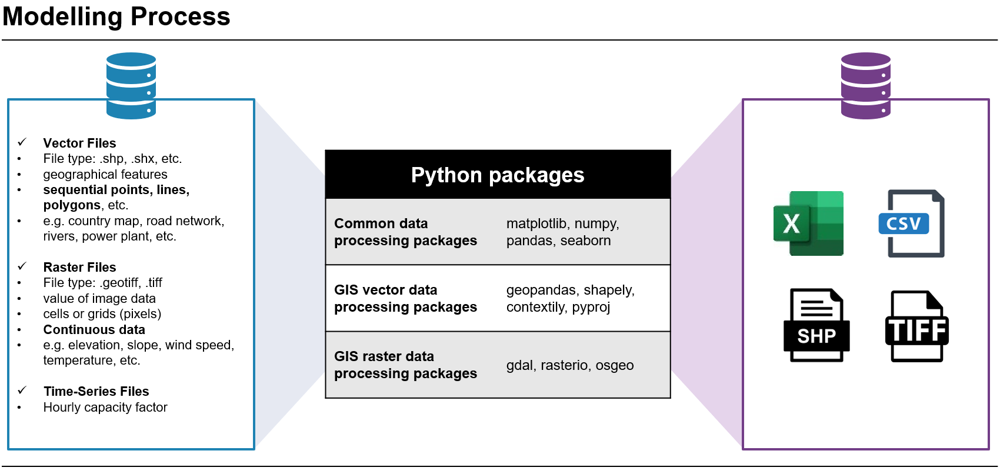

# Assessment of Renewable Energy Potentials based on Land Availability

Author: Yu-Chi Chang <br> For questions please contact: 

* Yu-Chi Chang ([yu-chi.chang@agora-energiewende.de](yu-chi.chang@agora-energiewende.de)) 
* Samarth Kumar ([samarth.kumar@agora-energiewende.de](samarth.kumar@agora-energiewende.de))
* International Energy Data and Modelling Team (IEDM) ([iedm@agora-energiewende.de](iedm@agora-energiewende.de) )

## Release Note

10-May-2021 - v1.0.0 Renew data sources with links of licensing.

04-May-2021 - v1.0.0-alpha In this version, the implementation is done for Vietnam. The input and output data files are provided separately. The data files can be downloaded from [link](https://cloud.sefep.eu/s/iyobP85aHCDm5MF). 

30-April-2021 - v0.0.0 Initial version 

## License

[The MIT License](License.txt)

# About

This project uses GIS model (Geographic Information System) along with spatial and statistical methods to analyse, store and calculate the digital information based on earth geographic surface. The model is divided into three stages (Land evaluation, renewable energy potentials and scenario analysis), and the structure is developed using Python scripts.

# Methodology

 

# Installation

There are many ways to install Python, but the Anaconda Python distribution is the easiest way for most new users to get started. Please check [Ananconda Install](https://www.anaconda.com/download/) on instructions to install anaconda, and [Anaconda Environment](https://conda.io/docs/user-guide/tasks/manage-environments.html) for creating and working with conda environement.

Please clone the repository into a local folder. As this repository is under active development, and hence use of git vc is recommended to update the changes. Please feel free to contribute. The required packages are written in environment file ([gis_land.yml](gis_land.yml)). You can change the name of the environment in [gis_land.yml](gis_land.yml): To create the environment navigate to local folder and use:

```
conda create env -f gis_land.yml
```

<!-- GIS_Land_VN relies on the following packages which are not contained in a standard Python installation. To install these packages, please refer to the installation guides from each website:

* [numpy](https://numpy.org/install/) (array and data sorting)
* [pandas](https://numpy.org/install/) (dataframe sorting )
* [matplotlib](https://pandas.pydata.org/pandas-docs/stable/getting_started/install.html) (import of the pyplot interface)
* [searborn](https://seaborn.pydata.org/installing.html) (plotting)
* [geopandas](https://geopandas.org/getting_started/install.html) (geospatial data processing)
* [shapely](https://anaconda.org/conda-forge/shapely) (geospatial data processing)
* [GDAL & rasterio & osgeo](https://rasterio.readthedocs.io/en/latest/installation.html) (geospatial data (raster file) processing) \*Only install one of three packages would be sufficient since rasterio and osgeo has dependencies on GDAL
* [pyproj](https://pyproj4.github.io/pyproj/stable/installation.html) (self-defined coordination reference system)
* [contextily](https://github.com/geopandas/contextily) (for fetching basemaps)
* [elevation](https://anaconda.org/conda-forge/elevation) (for elevation processing)
* [richdem](https://richdem.readthedocs.io/en/latest/using_it.html) (slope calculation)
* [xarray](http://xarray.pydata.org/en/stable/installing.html) (time series data (grib and NetCDF files)) -->

# Data Sources

Since all sources are open sources and can be directly downloaded from websites, all datafiles used in this package are not stored in this repository. To set up the correct paths, please choose one of two ways below:
1. Download the whole data files provided from [link](https://cloud.sefep.eu/s/iyobP85aHCDm5MF)
2. Download the data from each source seperately. Create and store in below subfolders:
* 00_data_vector (for vector data)
* 00_data_raster (for raster data)
* 00_data_time_series (for hourly time-series data)

| Parameter | Description | Data Type | Source | License | 
| ------------- | ------------- | ------------- | ------------- | ------------- | 
| Administartive Level 2 (Base Map) | Administrative boundaries of the second sub-national level (Country, County, etc) | Shapefile (Polygon) | [Humanitarian Data Exchange (HDX)/OCHA](https://data.humdata.org/dataset/viet-nam-administrative-boundaries-polygon-polyline) | [CC-BY 4.0](https://data.humdata.org/about/license) | 
| Landuse | Forests, parks, residential, industrial, military, etc. | Shapefile (Polygon) | [OpenStreetMap](https://download.geofabrik.de/asia.html) | [ODbL 1.0](https://www.openstreetmap.org/copyright) | 
| Building | Building outlines | Shapefile (Polygon) | [OpenStreetMap](https://download.geofabrik.de/asia.html) | [ODbL 1.0](https://www.openstreetmap.org/copyright) | 
| Water Areas | Rivers, lakes, reservoirs, docks, glaciers, etc. | Shapefile (Polygon) | [OpenStreetMap](https://download.geofabrik.de/asia.html) | [ODbL 1.0](https://www.openstreetmap.org/copyright) | 
| Roads Network | Road networks, tracks, paths, highways, etc. | Shapefile (Line) | [OpenStreetMap](https://download.geofabrik.de/asia.html) | [ODbL 1.0](https://www.openstreetmap.org/copyright) | 
| Railways | Railways, subways, trams, lifts, and cable cars, etc. | Shapefile (Line) | [OpenStreetMap](https://download.geofabrik.de/asia.html) | [ODbL 1.0](https://www.openstreetmap.org/copyright) | 
| Transport Stations | Railway stations, subway stations, airports, aprons | Shapefile (Point) | [OpenStreetMap](https://download.geofabrik.de/asia.html) | [ODbL 1.0](https://www.openstreetmap.org/copyright) | 
| Transmission Lines | Exisitng electricity transmission network (110kV, 200kV, 500kV) | Shapefile (Line) | [WorldBank](https://datacatalog.worldbank.org/dataset/vietnam-electricity-transmission-network-2016)| [CC-BY 4.0](https://datacatalog.worldbank.org/public-licenses#cc-by) | 
| Digital Elevation Model (DEM) | Elevation | Rasterfile (GeoTiff)| [OpenDevelopmentMekong](https://data.opendevelopmentmekong.net/en/dataset/digital-elevation-model-dem)| [CC-BY-SA-4.0](https://data.opendevelopmentmekong.net/en/dataset/digital-elevation-model-dem) | 
| Solar Resources | Solar irradiation (GHI, GTI, DIF, DNI), PV power potential (PVOUT), Air temparature (TEMP), etc. | Rasterfile (GeoTiff) | [GlobalSolarAtlas](https://globalsolaratlas.info/download)| [CC-BY 4.0](https://globalsolaratlas.info/download) | 
| Wind Resources | Wind speed, power density at different heights, etc. | Rasterfile (GeoTiff) | [GlobalWindAtlas](https://globalwindatlas.info/download/gis-files)| [CC-BY 4.0](https://globalwindatlas.info/about/TermsOfUse) | 
| Time-Series Data | Annual hourly wind speed, solar irradiation (Latitude x Longtitude: 0.25° x 0.25°) | Network Common Data Form (NetCDF) | [Copernicus Climate Data Store/ECMWF (ERA5)](https://cds.climate.copernicus.eu/cdsapp#!/dataset/reanalysis-era5-single-levels?tab=overview)| [Licence to use Copernicus Products](https://cds.climate.copernicus.eu/cdsapp#!/dataset/reanalysis-era5-single-levels?tab=overview) |

# Example scripts as Jupyter notebooks

The package codes are available as three jupyter notebooks:

* [01 Land evaluation](01_land_evaluation.ipynb)

  Land evaluation: find out available lands that can be used for renewable energy development.

* [02 Renewable energy potentials](02_renewable_potentials.ipynb)

  Renewable energy potentials: apply energy parameters onto the available land (output from the first stage).

* [03 Scenario analysis](03_scenario_analysis.ipynb)

  Based on the output of stage 1 and 2, the potential capactiy can be found based on some performance assumptions from current types of PV panels and wind turbine. Besides, combined with time-series data from open sources (hourly wind speed, hourly solar irradiation, etc), the estimated annual generation can be calculated.